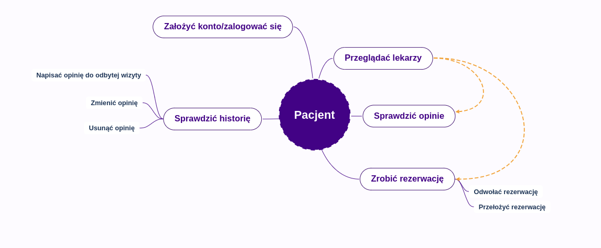
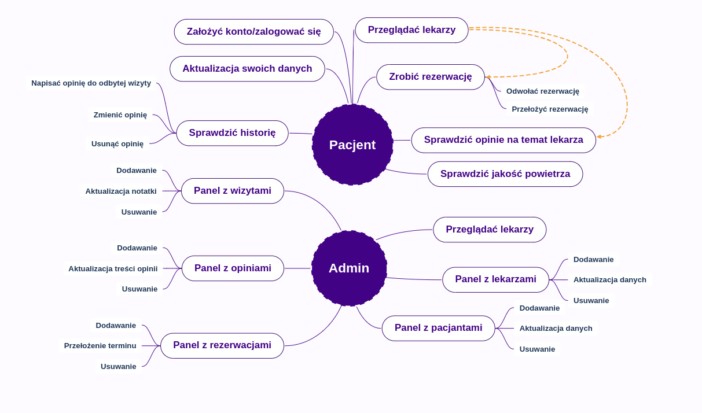
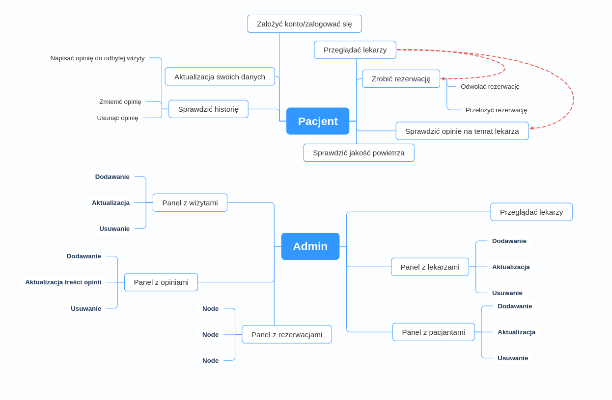

# Aplikacja E-Clinic

Projekt zaliczeniowy na koniec ścieżki zaJavka.pl


## Zawartość projektu
* [Ogólne informacje](#ogólne-informacje)
* [Technologie](#technologie)
* [Setup](#setup)
* [Grafiki](#grafiki)


## Ogólne informacje
<details>
<summary>Kliknij by wyświetlić informacje o <b>E-Clinic</b>!</summary>
Aplikacja ma za zadanie symulować przychodnie lekarską, do której można rejestrować się za pomocą internetu. Nie trzeba stać w kolejce,
nie trzeba dzwonić na rejestracje.
Główne technologie to Java (Spring Boot) i PostgresPSQL.
Aplikacja monitoruje też jakość powietrza w okolicy kliniki.
</details>

### Funkcjonalności:
<details>
W aplikacji można przeglądać dostępnych specjalistów, sprawdzić opinie innych pacjentów na ich temat, a także wystawić swoją opinię po zakończonej wizycie.
Można również sprawdzić historię wizyt i notatki do nich. Możesz zrobić rezerwację na konkretną godzinę, w jakiej lekarz przyjmuje danego dnia.<br/>
Jako administrator możesz przeglądać (usuwać, dodawać) lekarzy, pacjentów, wizyty, rezerwacje, opinie za pomocą dedykowanych paneli.
W przygotowaniu jest panel lekarza.
</details>


### Problemy:
<details>
Zbytnio rozbudowany kod, sporo niepotrzebnych metod, ogólnie mam problem z architekturą.
Problemy z frontem, brak ładu odnośnie stylów CSS (chcę wprowadzić jeden plik css z zastosowaniem BEM).
Mam problem z security, jest tylko podstawowe działanie z logowaniem.
Problem z docker-compose, po uruchomieniu kontenerów, aplikacji działa, ale nie mam logowania i są problemy z zasobami.
Nie byłem w stanie przetestować za pomocą RestAssured klasy VisitRestController, nie do końca rozumiem dlaczego tylko z tą klasą są problemy.
Nie sprawdzałem jak aplikacji wyświetla się na mniejszych ekranach.
</details>


### Rozwój projekty:
<details>
Należy wykonać panel lekarza.
Responsywne wyświetlanie strony w aplikacji.
Można zrobić jakieś ładniejsze wyświetlanie dostępnych lekarzy za pomocą kart-wizytówek.
Można pomyśleć nad zamianą Thymeleaf na TypeScript.
Wprowadzenie dodatkowych REST API, np. jakim autobusem/tramwajem, na którą godzinę pacjent dojedzie do kliniki.
Sprawdzenie pogody na dzień wizyty.
</details>

## Technologie
<ul>
<li>Java</li>
<li>Spring</li>
<li>Spring Boot</li>
<li>Gradle</li>
<li>Postgres</li>
<li>Hibernate</li>
<li>Flyway</li>
<li>Thymeleaf</li>
<li>HTML</li>
<li>CSS</li>
<li>BootStrap</li>
<li>JS</li>
<li>Docker</li>
<li>Docker compose</li>
<li>JUnit</li>
<li>Mockito</li>
<li>Hamcrest</li>
<li>RestAssured</li>
<li>Git</li>
</ul>


## Setup
Klonowanie repozytorium:```git clone https://github.com/tomasztaw/simple-clinic.git``` <br/>
Wystartuj kontenery ```docker-compouse up```<br/><br/>
Przykładowy użytkownik: <br/> login ```tomek``` hasło ```test```<br/>
Administrator: <br/> login ```admin``` hasło ```admin```


## Grafiki

### Funkcjonalności dostępne
#### v1 osobno


#### v1 razem


#### v2


### W przygotowaniu


### Diagram ERD


