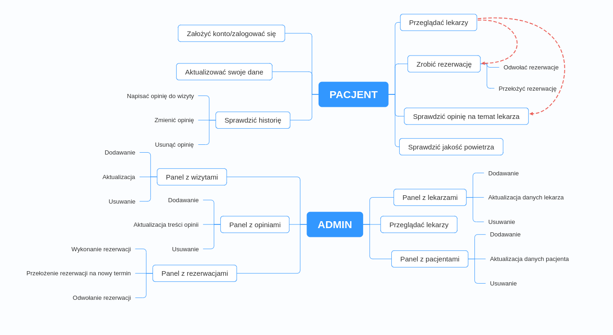
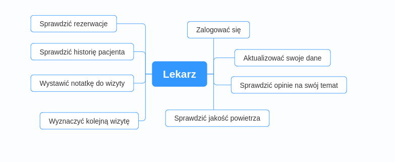
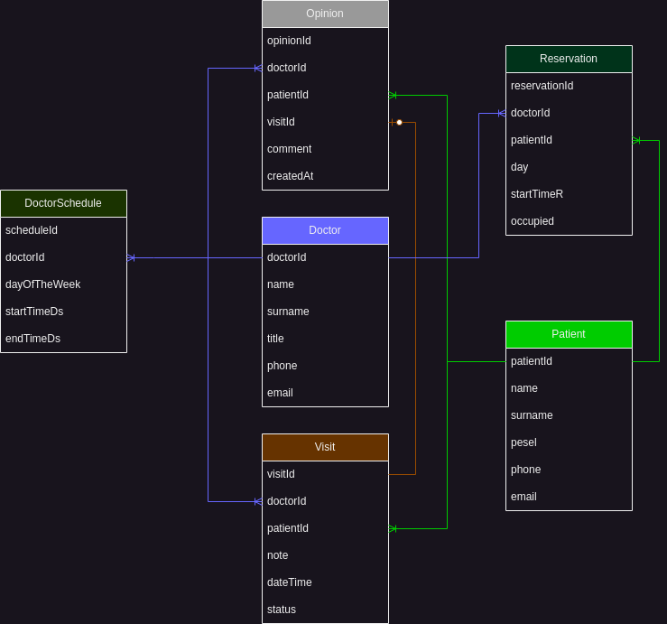

# Aplikacja E-Clinic (simple-clinic)

Projekt zaliczeniowy na koniec ścieżki zaJavka.pl


## Zawartość projektu
* [Ogólne informacje](#ogólne-informacje)
* [Technologie](#technologie)
* [Setup](#setup)
* [Grafiki](#grafiki)


## Ogólne informacje
<details>
<summary>Kliknij by wyświetlić informacje o <b>E-Clinic</b>!</summary>
<br>
Aplikacja ma za zadanie symulować przychodnię lekarską, do której można rejestrować się za pomocą internetu.<br> Nie trzeba stać w kolejce,
nie trzeba dzwonić na rejestracje.<br>
Główne technologie to Java (Spring Boot) i PostgresPSQL.<br>
Aplikacja monitoruje też jakość powietrza w okolicy kliniki.
</details>

### Funkcjonalności:
<details>
<br>
W aplikacji można przeglądać dostępnych specjalistów, sprawdzić opinie innych pacjentów na ich temat, a także wystawić swoją opinię po zakończonej wizycie.<br>
Można również sprawdzić historię wizyt i notatki do nich. Możesz zrobić rezerwację na konkretną godzinę, w jakiej lekarz przyjmuje danego dnia.<br>
Jako administrator możesz przeglądać (usuwać, dodawać) lekarzy, pacjentów, wizyty, rezerwacje, opinie za pomocą dedykowanych paneli.
W przygotowaniu jest panel lekarza.
</details>


### Problemy:
<details>
<br>
Największym problemem jest chęć umieszczenia w aplikacji "wszystkiego" co napotkam podczas nauki, poznawania programowania.
Przy jednoczesnym braku podstaw, prowadziło to do kręcenia się w kółko, przy bardzo powolnych postępach. Teraz już wiem po co są 
te wszystkie zasady i wzorce. I już mnie nie dziwi to, że przed napisaniem jakiegokolwiek kodu, ludzie rozmawiają na ten temat przez kilka godzin.
<br><br>
Zbytnio rozbudowany kod, sporo niepotrzebnych metod, ogólnie mam problem z architekturą.<br>
Słabo mi idzie z frontem, brak ładu odnośnie do stylów CSS (chcę wprowadzić jeden plik css z zastosowaniem BEM).<br>
Konfiguracja security, jest tylko podstawowe działanie z logowaniem.<br>
Trudności sprawiło mi docker-compose, po uruchomieniu kontenerów, aplikacji działa, ale nie było logowania i nie ładowało aktualnego obrazu.
Okazało się, że miałem profil "local" z wyłączonym security i żeby najnowszy obraz się załadował to trzeba było zrobić "builda" w Gradle:)<br>
Nie byłem w stanie przetestować za pomocą RestAssured klasy VisitRestController, nie do końca rozumiem, dlaczego tylko z tą klasą są problemy.<br>
Nie sprawdzałem jak aplikacji wyświetla się na mniejszych ekranach.
</details>


### Rozwój projekty:
<details>
<br>
Należy wykonać panel lekarza.<br>
Responsywne wyświetlanie strony w aplikacji.<br>
Można zrobić jakieś ładniejsze wyświetlanie dostępnych lekarzy za pomocą kart-wizytówek.<br>
Można pomyśleć nad zamianą Thymeleaf na TypeScript.<br>
Wprowadzenie dodatkowych REST API, np. jakim autobusem/tramwajem, na którą godzinę pacjent dojedzie do kliniki.<br>
Sprawdzenie pogody na dzień wizyty.
<br><br>
Posprzątać nadmiarowy kod :)
</details>

## 🛠 Technologie
<ul>
<li>Java</li>
<li>Spring</li>
<li>Spring Boot</li>
<li>Gradle</li>
<li>Postgres</li>
<li>Hibernate</li>
<li>Flyway</li>
<li>Thymeleaf</li>
<li>HTML</li>
<li>CSS</li>
<li>BootStrap</li>
<li>JS</li>
<li>Docker</li>
<li>Docker compose</li>
<li>JUnit</li>
<li>Mockito</li>
<li>Hamcrest</li>
<li>RestAssured</li>
<li>Git</li>
</ul>


## Setup
Klonowanie repozytorium:```git clone https://github.com/tomasztaw/simple-clinic.git``` <br>
Wystartuj kontenery ```docker-compouse up```<br><br>

Strona powitalna:
```bash
  localhost:8080/clinic/welcome
```

Przykładowy użytkownik: <br> login ```tomek``` hasło ```test```<br><br>
Administrator: <br> login ```admin``` hasło ```admin```<br><br>
Doktor (w przygotowaniu/są już jakieś wstępne funkcjonalności):<br>
login ```konrad``` hasło ```test```


## Grafiki

### Funkcjonalności dostępne


### W przygotowaniu


### Diagram ERD


